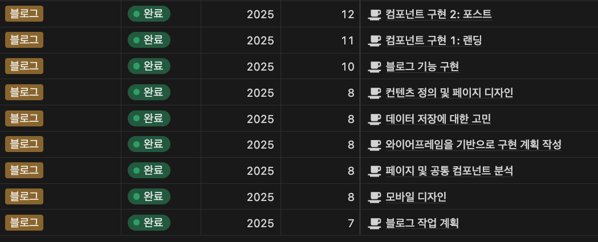
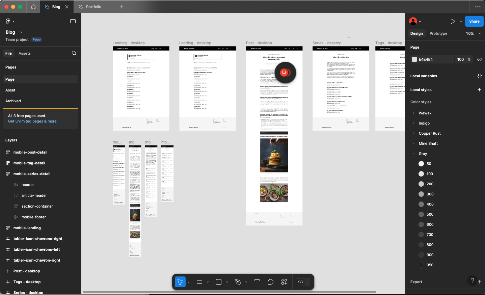
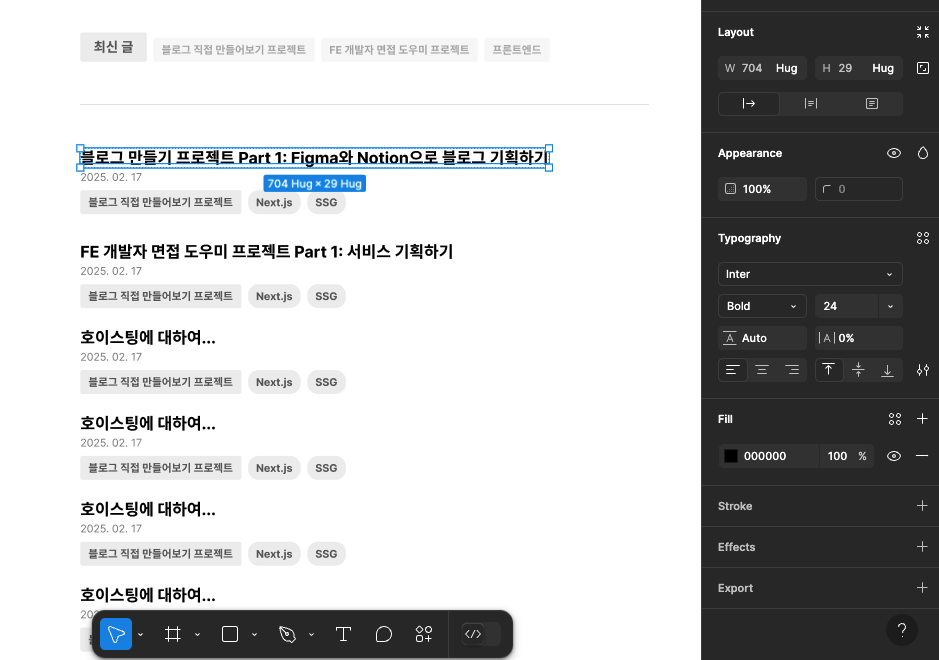

## 블로그를 만들게 된 계기

프론트엔드 개발자로서, 직업을 취미와 연결시켜보고 싶은 생각은 항상 있었지만, 뭘 만들어보면 좋을지 감을 잡지 못하고 있었다.
그러다가 문득 블로그를 직접 만들어보면 어떨까 라는 생각이 들었고, 그게 이 프로젝트의 시작이 되었다.  
블로그는 간단하니까 그냥 바로 코딩부터 해봐도 되지 않을까 라는 생각이 들었다. 그래도 프로젝트를 체계적으로 진행해보고 싶다는 생각이 들어, 기획과 디자인부터 시작해보았다.  
내가 만들고 싶은 블로그는 어떤 기능을 가져야 하는지, 그 기능은 어떤 일을 하는지 등을 글로 써내려가면서, 조금씩 블로그 프로젝트를 구체화 시켜나갔다.

먼저, 주요 개념부터 세웠다. 이 블로그는 게시글에 해당하는 `Post`와, 이 포스트를 묶는 대 분류인 `Series`, 소 분류인 `Tag`로 구성된다.  
미디움과 같은 블로그 서비스를 보면 연재글 기능을 제공한다. 예를 들면, 블로그 만들기 연재를 한다면, 여러 포스트를 연재라는 분류로 묶는데, 이 블로그에선 시리즈가 그 역할을 한다.  
이렇게 필요한 기능을 구상하다보니, 어떤 페이지가 필요한지, 또 어떤 UI가 나와줘야 하는지 도출해낼 수 있었다.

## 피그마를 통해 페이지 디자인

기획을 통해 어떤 UI나 페이지가 필요한지 간략하게 알게 되었으니, 이제 디자인을 할 차례이다.  
다만, 난 디자인 경험은 많이 없어서 다른 블로그를 많이 참고해가면서 작업하게 되었다.  
처음엔 모방으로 시작했지만, 하다보니 내 취향이 잔뜩 들어가면서 나만의 블로그 디자인이 탄생하게 되었다.  
또, 처음부터 모바일에서 사용하는것을 고려해서 디자인했는데, 이게 정말 좋은 결정이었다.  
덕분에 나중에 반응형으로 구현할 때 수월하게 작업할 수 있었다. UI를 어떻게 구성해서 반응형으로 만들지를 디자인 시점에 고민하고,  
구현할 때는 그대로 코딩만 했기에, 디자인과 코딩이라는 역할과 책임이 적절하게 분리되었다고 생각한다.

## 디자인 시스템의 도움을 받기

다만 디자인 공부를 아예 안하고 도전한건 아니었다.  
회사 동료로 부터 추천받은 [`Refactoring UI`](https://www.refactoringui.com)이라는 책을 읽고, 공부했던게 많은 도움이 되었다.
이 책에서 제일 기억에 남는건 디자인 시스템이었다. `Mantine UI`나 `Tailwind`과 같은 디자인 라이브러리는 디자인 시스템을 제공한다.
sizing과 색상 팔레트가 정해져있고, 이 중에서 필요한걸 가져다 사용하면 된다.
디자인 시스템에서 작업하면 매번 1px씩 조정하거나 rgb 컬러를 아주 미세하게 조정하면서 색상을 부여하지 않기 때문에
일관성 있게 디자인할 수 있다.  
나와 같은 디자인 뉴비는 디자인 시스템에서 작업하는 것 만으로도 어느정도 일관성 있는 디자인이 가능해지기 때문에 필수라는 생각이 든다.

또한 시각적 계층을 명학하게 하려고 노력했다. 그래야 페이지의 더 중요한 부분을 강조할 수 있기 때문이다.  
이게 잘 안돼면 덜 중요한 부분이 강조되는 등, 방문자 입장에서 페이지가 산만하다고 느낄 수 있기에, 이 부분을 최대한 신경써보았다.
폰트 크기나 볼드만 가지고 이를 표현하게 보다, 색상과 명도로 표현해보려고 했다.  
RefactoringUI에 따르면, 색상과 명도로 이를 구분하면 세련되면서 충분히 강조할 수 있다고 한다.  
실제로 다른 웹사이트를 참고해보아도, 명도를 통해 시각적 계층을 표현하는 것을 알 수 있다.

이런 과정을 거쳐 블로그 기획과 디자인을 하게 되었는데, 직접 처음부터 끝까지 해본건 처음이라 시행착오도 참 많았다.
페이지를 디자인하고 지우기를 여러번 반복했던 것 같다. 그래도 오히려 재미있는 경험이었다.

다음 포스트에선 블로그 구현에 사용한 기술 스택에 대한 내용을 포스팅하겠습니다.  
긴 글 읽어주셔서 감사합니다.

export const metadata = {
  title: '블로그 만들기 시리즈 Part 1: 기획부터 디자인까지',
  series: 'blog-making-series',
  tags: ['기획', 'Figma', 'Notion'],
  date: '2025-03-05 22:42',
};
