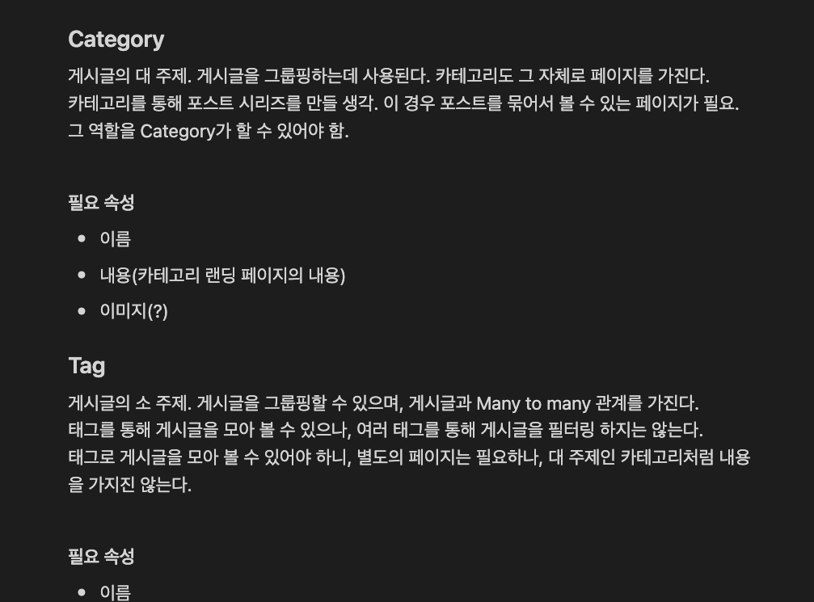
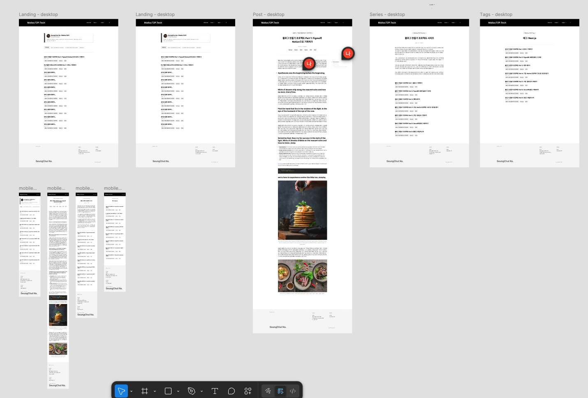
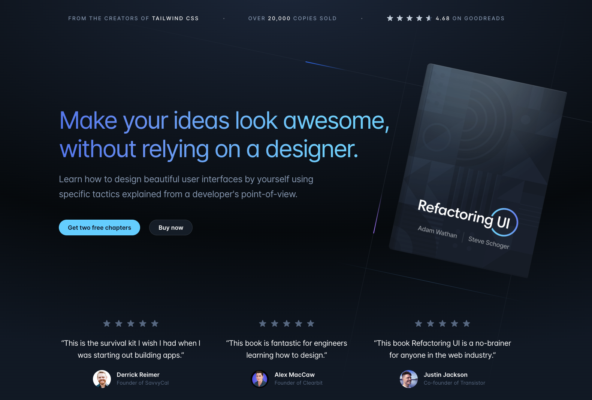

## 블로그를 직접 만들어보자!

개발자라면 나만의 블로그를 직접 만들어보고 싶어할 것 같습니다. 일단 전 그랬습니다 🤣  
이 글에선 블로그를 직접 만들면서 겪은 시행착오를 여러분과 공유하려고 합니다.

## Head First Blog! 블로그 기능 정리부터 시작.

자신이 살 집을 직접 설계하고 짓는 사람들처럼, 저도 제 블로그를 직접 설계하고 디자인하고 구현해보고 싶었습니다.  
하지만 기획도, 디자인도 처음이라 참 막막했습니다.  
그래서 우선, Notion에 제가 만들고 싶은 블로그는 어떤 서비스인지 부터 글로 정리해보았습니다.

먼저, 블로그의 글(Post)을 카테고리로 묶고 싶었습니다. 그래서 카테고리에 대한 내용을 정리해보았습니다.  
그러다보니 태그도 필요하겠다는 생각이 들더라구요. 카테고리는 대주제이니, 게시글 하나당 하나의 카테고리만 연관되지만,  
다대다 관계로 분류할 수 있는 장치가 있었으면 했습니다. 그래야 소 주제로 게시글을 모을 수 있으니까요.  
이렇게 제가 원하는 블로그에 대한 기능을 하나씩 정리해나갔습니다.

## 필요한 페이지 및 컴포넌트 정리하기

기능을 정리하니, 어떤 페이지와 컴포넌트가 필요한지를 정리하기로 했습니다.
필요한 페이지를 정리하니, 이렇게 목록이 나왔습니다

- 랜딩 페이지
  - 최신 포스트 n개 표시
  - 카테고리(Series)별 게시글 필터링
- 메인 헤더
  - 페이지 로고
  - 카테고리, 태그 페이지로 진입할 수 있는 드롭다운 메뉴
- 카테고리, 태그 페이지
  - 카테고리, 태그에 속하는 모든 페이지 목록 조회
- 게시글 상세 페이지
  - 아티클 헤더
  - 아티클
  - TOC

위와 같이 필요한 페이지 목록을 뽑고 나니, 조금씩 작업이 진행되는 느낌이 들었습니다.  
이 다음으로 페이지 디자인을 시작했습니다. 어떤 페이지와 컴포넌트가 필요한지 정리가 되니 뭘 해야 할지 명확해서 막힘없이 진행할 수 있었습니다.

## Figma로 페이지 디자인하기

피그마는 회사에서 일하면서 조금씩 건드려봤던게 전부라서, 사용법부터 익혀야 했습니다.  
그래도 피그마가 쉽고 직관적인 UI를 가져서 그리 어렵지 않게 다룰 수 있었습니다.  
물론 전문가분들만큼 모든 기능을 사용하지는 못했지만요. 🤣  
그래도 블로그를 디자인할 정도는 되었던 것 같습니다!

사실 어려운건 피그마가 아니라 디자인이었습니다. 디자인 관련해선 아는게 없다보니 이 부분은 참 막막하더라구요.  
그래서 다른 블로그를 참고해가면서 디자인해보았습니다.  
몇몇 부분은 따라해보기도 하고, 조금씩 제 입맛에 맞게 변형해보기도 했습니다.  
하지만, 명확한 기준이 없다보니 디자인은 점점 미궁속으로 빠져들어갔습니다.

## RefactoringUI라는 책을 참고해서 디자인

그러다 회사 동료의 추천으로 [RefactoringUI](https://www.refactoringui.com/)라는 책을 읽어보게 되었습니다.

이 책에선 왜 디자인 시스템을 사용해야 하고, 디자인 시스템을 기반으로 디자인 했을 때 얻는 이점에 대해 자세히 설명해줍니다.  
또 디자인할 때 어떻게 생각해야하는지, 어떤 상황일때는 어떻게 디자인하면 좋을지에 대해 예시를 들어주면서 알려주는 책인데 이번 블로그를 디자인할때 큰 도움이 되었습니다.  
어떤 부분이 제일 도움이 되었냐 라고 물어보신다면, 디자인에 있어서 지켜주어야 할 규칙에 대해 수박 겉햝기 수준이라도 알게 된 점을 꼽을 것 같습니다.  
이 부분에 대해서도 블로그 글로 정리해보면 좋겠다는 생각이 드네요!

물론 여전히 부족한 점이 많은 디자인이긴 하지만, 그래도 첫 디자인인걸 생각하면 나쁘지 않았다고 생각합니다...! 😅

export const metadata = {
  title: 'Nextjs로 블로그 만들기 시리즈 Part 1. 기획 & 디자인',
  series: 'blog-making-series',
  tags: ['기획', 'Figma', 'Notion'],
  date: '2025-03-05 22:42',
};
