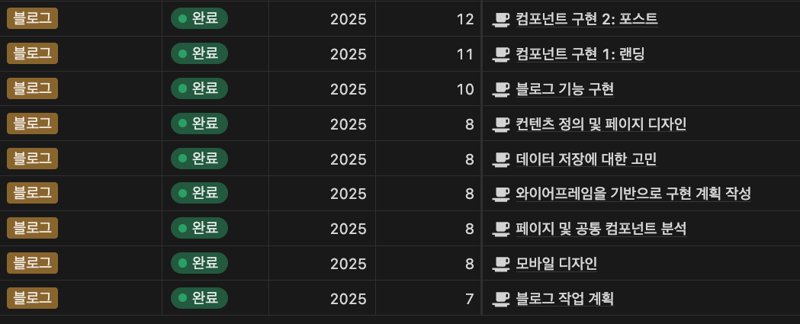
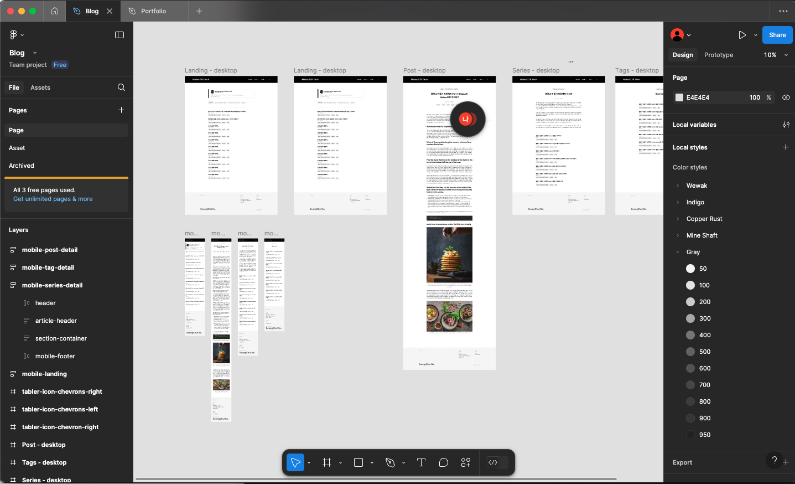
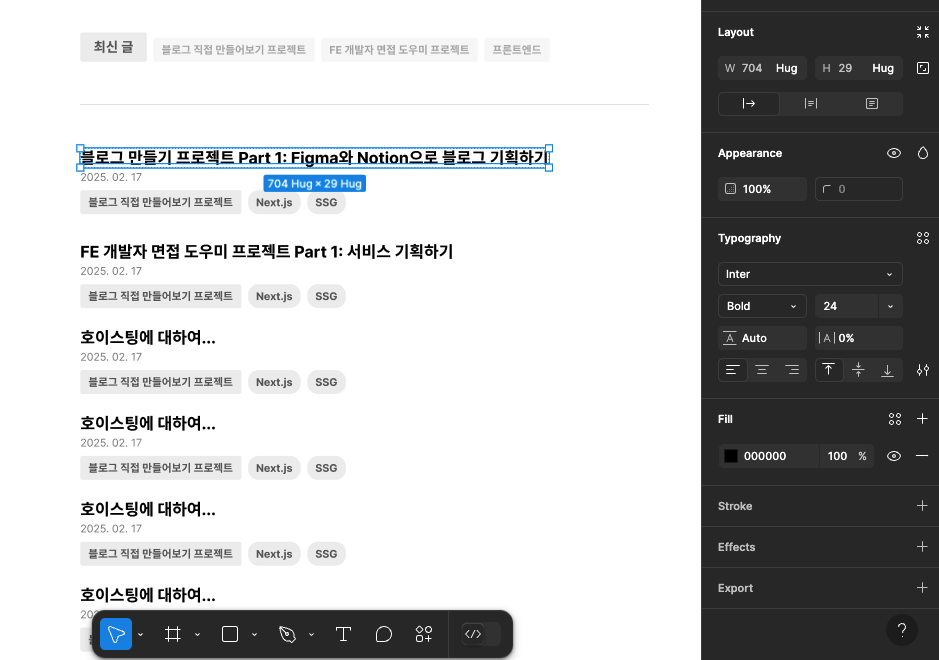

## 쉽지 않은 첫번째 기획

블로그를 직접 만들게 된 계기는 다른 분들과 비슷하답니다. "프론트엔드 개발자로 일하면서 배운 것을 직접 써먹어보고싶다!"라는 취지도 있었고,
취미와 병행해서 개발 공부를 하고 싶었던 것도 있었습니다. 다만, 혼자서 기획부터 디자인, 구현 배포까지 전부 하려니, 꽤 막막했습니다.
그래서 우선, 만들고 싶은 블로그에 대한 이야기를 노션으로 정리해보았습니다. 블로그는 어떤 기능을 가져야 하는지부터 차근차근, 조금씩 적어나갔습니다.

생각을 글로 정리하고, 좀 더 구체적인 내용으로 확장시켜나가면서, 비록 글 뿐이지만 어떤 블로그인지, 또 어떤 기능을 가지게 될 지 조금씩 윤곽이 잡혀나갔습니다.
하지만 글로만 정리하자니, 모호한 부분이 많아 쉽지 않았답니다.

## 피그마를 통해 계획을 구체화

글로만 정리해서는 어렵겠다 생각이 들어서, 그래서 기능 정의와 병행하여 페이지를 디자인해보기로 했답니다.
눈에 보이는게 있다면 필요한 기능도 명확해질 것 같다는 생각이었는데, 지금 생각해보면 괜찮은 생각이었던 것 같아요!
내가 만들 블로그는 어떤 모습일까, 이런 모습이면 좋겠다 라는 생각을 하면서 조금씩 피그마로 페이지를 깍아나갔습니다.
다른 블로그도 많이 참고해가면서, 페이지를 디자인하고 지우기를 반복하면서 일주일의 시간을 즐겁게 보냈던 것 같습니다.

하지만 디자인은 처음인지라, 정말 쉽지 않았답니다...!

## 디자인 시스템의 도움을 받기

프론트엔드 개발은 조금 해보긴 했지만, 디자인은 전혀 해본 경험이 없었습니다. 그래서 도움을 조금 받기로 했습니다!
회사 동료분께 추천받은 [`Refactoring UI`](https://www.refactoringui.com)라는 책을 선생님으로 삼아, 차근차근 디자인해보기로 했습니다.
먼저 디자인 시스템부터 정하기로 했습니다. 직접 만들기보다, 이미 있는 디자인 시스템을 사용하는게 좋겠다고 생각하여, `Tailwind의` 디자인 시스템을 채용했습니다.
덕분에 아래와 같은 이점을 얻게 되었습니다

- 디자인 시스템에서 정해주는 `spacing`, `sizing`을 사용하여 일관된 디자인 유지
- 빠른 개발! ⚡️

이제 디자인 시스템이 생겼으니, 페이지를 디자인하면 되는데, 이게 또 쉽지 않더라구요...

## 다른 블로그를 참고해보기

그래서 다른 블로그를 참고하여 디자인해보기로 했습니다. 제가 참고한 블로그는 [`Dropbox`](https://dropbox.tech/)와 [`Figma`](https://www.figma.com/blog/)의 기술블로그였습니다.
헤더에 패딩은 얼마나 주고 있는지, 포스트 목록에서 간격은 얼마나 주는지, 색의 조합은 어떻게 가져가는지, `paragraph`의 `line-height`는 얼마나 주는지 등 여러 부분을 살펴보고 배우게 되었습니다.
디자이너 분들이 얼마나 많은 고민을 하고 페이지를 디자인했을지 감탄하면서, 저도 제 블로그를 조금씩 디자인해보았습니다.

물론 디자이너는 아닌지라, 진짜 디자이너분들이 한 것에 비하면 많이 부족하지만, 적어도 RefactoringUI에서 가르쳐준 내용을 따라가면 그나마 덜 촌스러운 디자인이 되겠다는 생각이 들었습니다.
그래서 폰트 크기나 색 사용에 주의를 해가며 작업했습니다.
특히, 시각적 계층을 명확하게 하려고 노력했습니다. 폰트 크기나 보더, 쉐도우 등으로 이를 표현하기보다, 명도를 통해 해결하려고 했습니다.
디자인 시스템에서 제공하는 회색 팔레트를 많이 활용했던 것 같습니다. 중요한 텍스트는 950, 덜 중요한 텍스트는 400으로 표현하여, 더 중요한 부분, 예를 들면 제목이 더 눈길을 끌 수 있도록 디자인해보았답니다.

이렇게 하여, 제 인생 첫번째 웹사이트 디자인이 탄생하게 되었습니다...!

다음 포스트에선 블로그 구현 계획 수립에 대한 내용을 다루도록 하겠습니다.

export const metadata = {
  title: '블로그 만들기 시리즈 Part 1: 기획부터 디자인까지',
  series: 'blog-making-series',
  tags: ['기획', 'Figma', 'Notion'],
  date: '2025-03-05 22:42',
};
