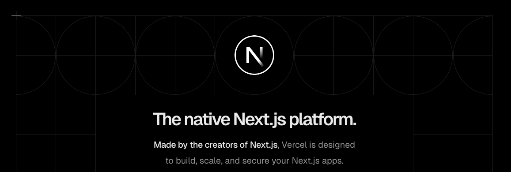
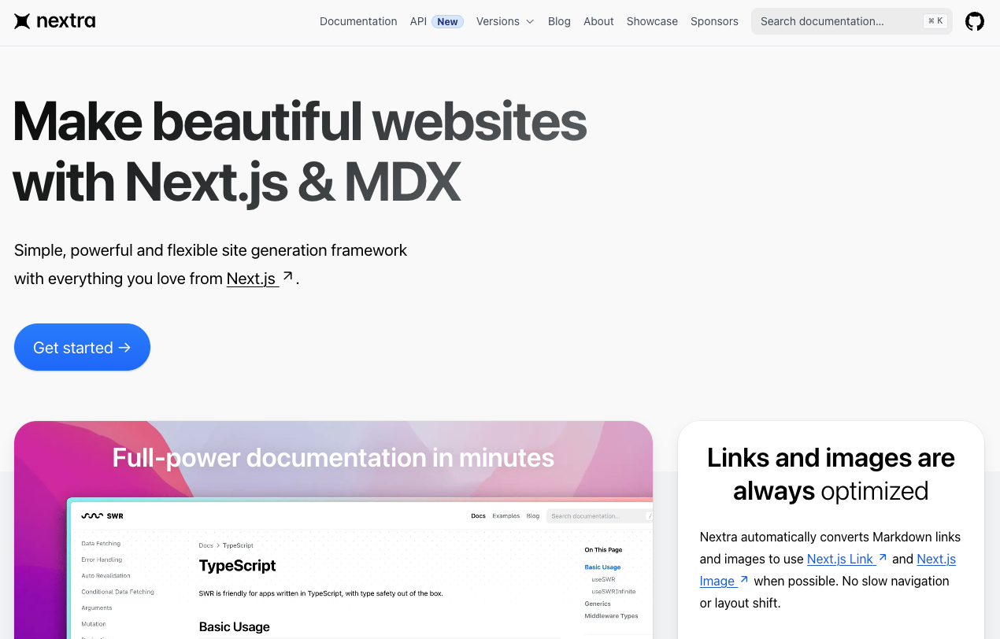
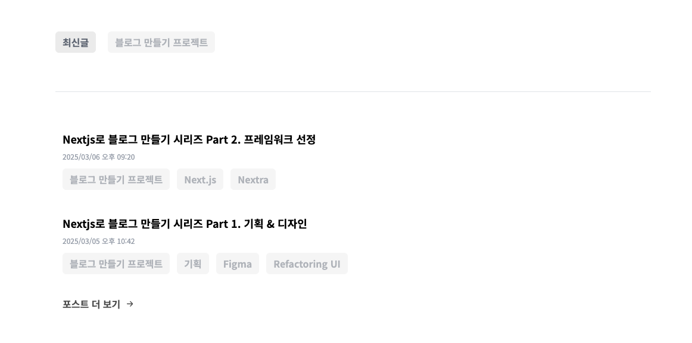

## 프레임워크 선정

개인 블로그를 만들고 운영하기 위해, 제 상황에 가장 적절한 인프라와 프레임워크를 고르는 과정을 공유하려고 합니다.  
먼저, 어떤 점을 고민했냐면요,

- 운영 및 배포하기 쉬워야 함
- 운영 비용이 적어야 합니다. 가능하면 무료로 운영하고 싶었습니다.

이 두 가지에 중점을 두고 찾아보니, 가장 최적의 조합은 Next.js와 Vercel이었습니다. 💎



## 왜 Next.js와 Vercel을 선택했는지에 대해...

웹서버를 무료로 운영한다면, 다음과 같은 플랫폼을 이용할 수 있습니다.

- Github Pages
- Netlify
- Vercel

많이 사용하는 웹 호스팅 서비스입니다. 먼저 비용을 고려해보면 각각 무료 플랜을 제공하고, 개인 블로그라면 트래픽 제한 걱정 없이 이용할 수 있습니다.  
물론 방문자가 아주아주 많아지면 문제가 되겠지만, 그런 행복한 고민을 하게 된다면 유료 플랜으로 올리면 되는 문제라 크게 고민하지 않았습니다.

그렇다면, 서비스를 배포하기 쉬운 플랫폼을 고르는게 좋겠다고 생각했습니다.
Vercel과 Netlify 둘 다 훌륭한 호스팅 서비스라, 정말 쉽게 서비스를 호스팅할 수 있습니다.  
다만 Next.js가 Vercel이 주도해 개발한 만큼, Next.js를 사용하는 경우 Vercel이 제일 적합합니다.  
그래서, 인프라는 어떤 프레임워크를 사용할지 결정한 다음 고르기로 했습니다.

## Next.js를 선택한 이유

프론트엔드 세계에는 매력적인 프레임워크가 정말 많습니다. Nuxt, Next, Svelte, Meteor.js등 정말 많은, 훌륭한 프레임워크가 많죠.  
그 중에서 Next.js를 고르기로 했습니다. 그 이유를 정리하면...

- React.js가 제일 익숙하기도 하고,
- Next.js의 파일시스템 기반 라우팅이 익숙하기도 하고,
- 무엇보다 Nextra의 존재 때문이었습니다.

갑자기 뜬금없이 Nextra가 나와서 이상하게 느끼셨을 수 있을 것 같은데요, 잠깐 Nextra 소개를 하려고 합니다!

## 문서, 블로그 개발에 최적화된 프레임워크 Nextra



Nextra는 문서사이트나 블로그 개발에 최적화된 프레임워크 입니다.  
실제로 제가 다니고 있는 회사에선 Nextra를 사용해서 제품을 위한 API 문서 사이트를 개발했습니다.  
Nextra의 [주요 특징](https://nextra.site/)을 살펴보면...

- Next.js 기반 프레임워크로, Next.js의 기능을 전부 사용 가능합니다
- MDX를 파싱하여 웹페이지로 빌드할 수 있습니다.
- 마크다운 안의 링크나 이미지를 빌드 시점에 Next.js Link, Image로 자동 변환해주어, 레이아웃 시프트 없이 빠르게 렌더링됩니다.
- [PageFind](https://github.com/cloudcannon/pagefind) 기반 `Full-Text` 검색 기능을 제공합니다.
- 예쁜 기본 테마를 제공합니다. 이걸 사용하면 그대로 블로그를 만들 수 있기에, 컨텐츠 작성만 하면 됩니다.

또한, 빌드 시점에 MDX 문서를 파싱하여 정적 웹페이지로 빌드하는, SSG(Static Site Generation)방식으로 개발하기 때문에, 백엔드 서버나 데이터베이스가 따로 필요하지 않습니다.  
그러면서도 검색 기능도 쉽게 구현 가능하니, 정말 괜찮은 프레임워크라고 생각합니다. 💎

결론적으로, 프레임워크는 Next.js를, 호스팅은 Vercel로 결정했습니다.

## Nextra Theme를 사용하지 않은 이유에 대해


Nextra는 기본 테마를 제공하는데, 이게 꽤 깔끔하고 예쁩니다. 물론 예쁜건 주관적이긴 하지만요.
그래도 Github Star가 12.7K인걸 보면, 많은 사람들이 저랑 비슷한 생각을 하는 것 같네요. 😍

하지만 전 이 테마를 사용하지 않고 직접 구현하기로 했습니다. 이유는 저만의 블로그를 만들고 싶어서 입니다.  
학습 목적도 있긴 했지만, 제가 직접 디자인한 블로그를 만들어 보고 싶었기에, 쉬운 길을 놔두고 굳이 어려운 길을 걷게 되었답니다.

## Nextra API. getPageMap & normalizePages

Nextra는 기본 테마를 사용하지 않더라도, 다양한 API를 제공하기 때문에 어렵지 않게 직접 구현할 수 있습니다.  
그 중 제일 핵심이 되는 API는 getPageMap과 normalizePages입니다.

이름에서 알 수 있는 것 처럼, getPageMap은 인자로 지정한 경로의 모든 페이지 맵 정보를 반환합니다.  
normalizePages는 getPageMap이 반환한 페이지 맵 정보를 가공합니다.  
Navbar, TOC, Post List등의 컴포넌트 구현에 적합한 형태로 데이터를 가공한다고 보시면 됩니다.  
기본 테마를 사용한다면, 반환객체를 그대로 사용하면 됩니다만, 커스텀 테마를 직접 구현하는 경우에도, 이걸 활용할 수 있습니다.

아래는 예시 코드입니다.

```ts
import { getPageMap } from 'nextra/page-map';
import { Item, normalizePages } from 'nextra/normalize-pages';

export async function findPosts(param: FindPostsProps = GetPostDefaultOption) {
  const { orderBy, limit, seriesId } = prepareParam<FindPostsProps>(param, GetPostDefaultOption);
  const fullRoute = resolveSeriesQuery(seriesId);

  // getPageMap으로 지정한 경로의 모든 페이지 정보를 가져온다.
  const pageMap = await getPageMap(fullRoute);

  // 가져온 페이지 정보를 가공한다.
  const { directories } = normalizePages({
    list: pageMap,
    route: '/posts',
  });

  // 필요한 만큼 데이터를 추가 가공한다(배열 평탄화, 필터링, 정렬, ...)
  let posts = directories
    .reduce((acc, curr) => collectPost(acc, curr), [] as Item[])
    .flat()
    .filter((post) => post.frontMatter)
    .filter((post) => !post.frontMatter.isSeriesLanding);

  if (orderBy) {
    posts.sort(sortPostByCreatedAt);
  }

  if (limit) {
    posts = posts.filter((_, i) => i < limit);
  }

  // 지정한 경로 밑의 모든 게시글 목록 반환
  return posts;
}
```

서버 컴포넌트에서 위의 findPosts를 호출하고 게시글 목록을 props로 내려줄 수 있습니다.  
이를 응용하여 랜딩 페이지에서 게시글 목록을 보여주는 기능을 구현할 수 있습니다.  
아래는 서버 컴포넌트 예시입니다.

```ts
export default async function LandingPage() {
  const seriesModels: SeriesModel[] = await getSeries();
  const seriesPosts: Record<string, PostModel[]> = {};

  for (const series of seriesModels) {
    if (series.id === Constants.series.latestId) {
      continue;
    }
    // findPosts를 통해 지정한 경로의 모든 게시글 목록을 조회
    const seriesPost = await findPosts({
      limit: 20,
      seriesId: series.id,
    });

    // 클라이언트 컴포넌트가 의존하는 타입인 PostModel로 변환
    seriesPosts[series.id] = seriesPost.map((item) => Mapper.toPostModel({ item, seriesModels }));
  }

  // Props로 게시글 목록 내려주기
  return <MainClientPage seriesPosts={seriesPosts} />;
}
```

클라이언트 컴포넌트는 props를 통해 받은 게시글 목록을 사용해서 랜딩페이지의 게시글 목록을 보여줄 수 있습니다.



이러한 페이지는 SSG 방식으로 빌드됩니다. 따라서 애플리케이션 빌드 시점에 서버 컴포넌트의 로직을 실행하여 가져온 데이터를 기반으로 정적 웹 페이지를 만들게 됩니다.  
새로운 포스트를 작성했다면, 새로 커밋하고 푸시해서 앱을 리빌드해야 목록에 새로운 포스트가 추가되는 방식입니다.

## 정리하면...

이번 포스트에선 왜 Next.js와 Vercel을 사용하게 되었는지에 대해 다루었습니다.  
추가로 Nextra의 API인 getPageMap과 normalizePages도 소개드렸네요.

다음 포스트에선 Nextra로 블로그를 구현하면서 겪었던 시행착오에 대해 다루려고 합니다.  
긴 글 읽어주셔서 감사합니다!

export const metadata = {
  title: 'Nextjs로 블로그 만들기 시리즈 Part 2. 프레임워크 선정',
  series: 'blog-making-series',
  tags: ['Next.js', 'Nextra', 'Vercel'],
  date: '2025-03-06 21:20',
};
