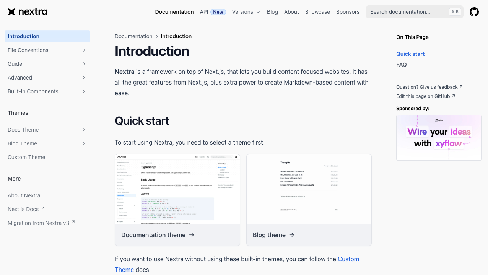

## 프레임워크 선정

개인 블로그를 만들고 운영하기 위해, 제 상황에 가장 적절한 인프라와 프레임워크를 고르는 과정을 공유하려고 합니다.  
먼저, 어떤 점을 고민했냐면요,

- 운영 및 배포하기 쉬워야 함
- 운영 비용이 적어야 합니다. 가능하면 무료로 운영하고 싶었습니다.

이 두 가지에 중점을 두고 찾아보니, 가장 최적의 조합은 Next.js와 Vercel이었습니다. 💎

## 왜 Next.js와 Vercel을 선택했는지에 대해...

웹서버를 무료로 운영한다면, 다음과 같은 플랫폼을 이용할 수 있습니다.

- Github Pages
- Netlify
- Vercel

많이 사용하는 웹 호스팅 서비스입니다. 먼저 비용을 고려해보면 각각 무료 플랜을 제공하고, 개인 블로그라면 트래픽 제한 걱정 없이 이용할 수 있습니다.  
물론 방문자가 아주아주 많아지면 문제가 되겠지만, 그런 행복한 고민을 하게 된다면 유료 플랜으로 올리면 되는 문제라 크게 고민하지 않았습니다.

그렇다면, 서비스를 배포하기 쉬운 플랫폼을 고르는게 좋겠다고 생각했습니다.
Vercel과 Netlify 둘 다 훌륭한 호스팅 서비스라, 정말 쉽게 서비스를 호스팅할 수 있습니다.  
다만 Next.js가 Vercel이 주도해 개발한 만큼, Next.js를 사용하는 경우 Vercel이 제일 적합합니다.  
그래서, 인프라는 어떤 프레임워크를 사용할지 결정한 다음 고르기로 했습니다.

## Next.js를 선택한 이유

프론트엔드 세계에는 매력적인 프레임워크가 정말 많습니다. Nuxt, Next, Svelte, Meteor.js등 정말 많은, 훌륭한 프레임워크가 많죠.  
그 중에서 Next.js를 고르기로 했습니다. 그 이유를 정리하면...

- React.js가 제일 익숙하기도 하고,
- Next.js의 파일시스템 기반 라우팅이 익숙하기도 하고,
- 무엇보다 Nextra의 존재 때문이었습니다.

갑자기 뜬금없이 Nextra가 나와서 이상하게 느끼셨을 수 있을 것 같은데요, 잠깐 Nextra 소개를 하려고 합니다!

## 문서, 블로그 개발에 최적화된 프레임워크 Nextra

Nextra는 문서사이트나 블로그 개발에 최적화된 프레임워크 입니다.  
실제로 제가 다니고 있는 회사에선 Nextra를 사용해서 제품을 위한 API 문서 사이트를 개발했습니다.  
Nextra의 [주요 특징](https://nextra.site/)을 살펴보면...

- Next.js 기반 프레임워크로, Next.js의 기능을 전부 사용 가능합니다
- MDX를 파싱하여 웹페이지로 빌드할 수 있습니다.
- 마크다운 안의 링크나 이미지를 빌드 시점에 Next.js Link, Image로 자동 변환해주어, 레이아웃 시프트 없이 빠르게 렌더링됩니다.
- [PageFind](https://github.com/cloudcannon/pagefind) 기반 `Full-Text` 검색 기능을 제공합니다.
- 예쁜 기본 테마를 제공합니다. 이걸 사용하면 그대로 블로그를 만들 수 있기에, 컨텐츠 작성만 하면 됩니다.

또한, 빌드 시점에 MDX 문서를 파싱하여 정적 웹페이지로 빌드하는, SSG(Static Site Generation)방식으로 개발하기 때문에, 백엔드 서버나 데이터베이스가 따로 필요하지 않습니다.  
그러면서도 검색 기능도 쉽게 구현 가능하니, 정말 괜찮은 프레임워크라고 생각합니다. 💎

결론적으로, 프레임워크는 Next.js를, 호스팅은 Vercel로 결정했습니다.

## Nextra Theme를 사용하지 않은 이유에 대해

Nextra는 기본 테마를 제공하는데, 이게 꽤 깔끔하고 예쁩니다. 물론 예쁜건 주관적이긴 하지만요.
그래도 Github Star가 12.7K인걸 보면, 많은 사람들이 저랑 비슷한 생각을 하는 것 같네요. 😍

하지만 전 이 테마를 사용하지 않고 직접 구현하기로 했습니다. 이유는 저만의 블로그를 만들고 싶어서 입니다.  
학습 목적도 있긴 했지만, 제가 직접 디자인한 블로그를 만들어 보고 싶었기에, 쉬운 길을 놔두고 굳이 어려운 길을 걷게 되었답니다.

## 정리하면...

이번 포스트에선 왜 Next.js를 기반으로 한 Nextra를 사용했는지, 그리고 Vercel에 배포하게 된 이유에 대해 소개해드렸습니다.

긴 글 읽어주셔서 감사합니다!

export const metadata = {
  title: 'Nextjs로 블로그 만들기 시리즈 Part 2. 프레임워크 선정',
  description:
    '개인 블로그를 직접 구현하기 위해 어떤 프레임워크와 호스팅 업체를 고를지 고민한 내용을 다룬 글 입니다.',
  series: 'blog-making-series',
  tags: ['Next.js', 'Nextra', 'Vercel'],
  date: '2025-03-06 21:20',
};
