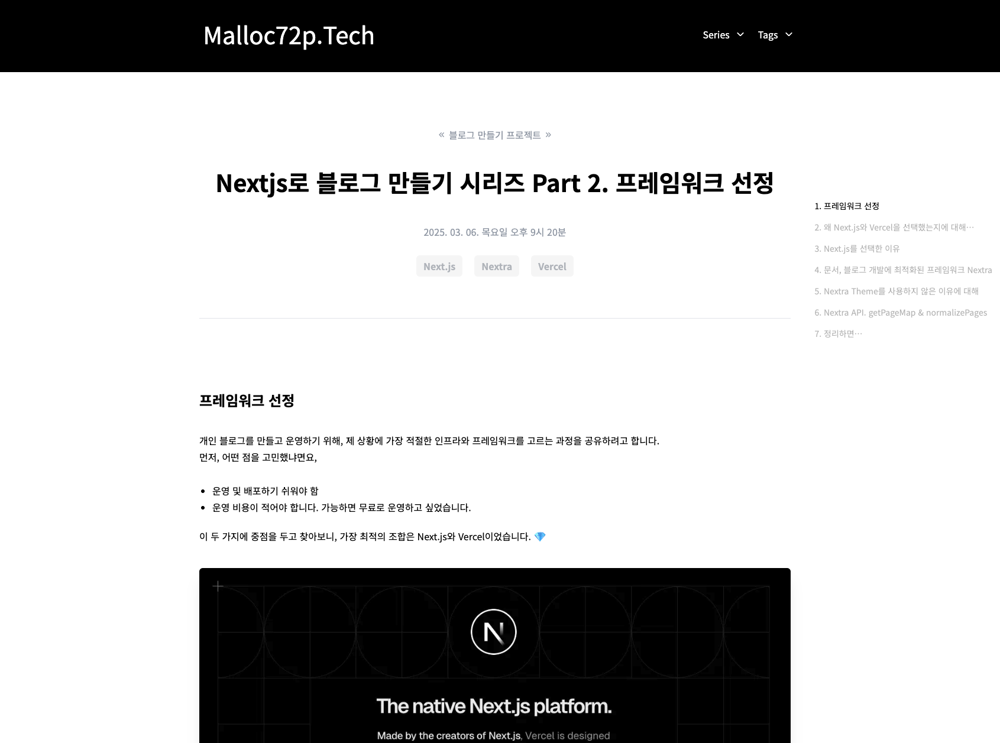
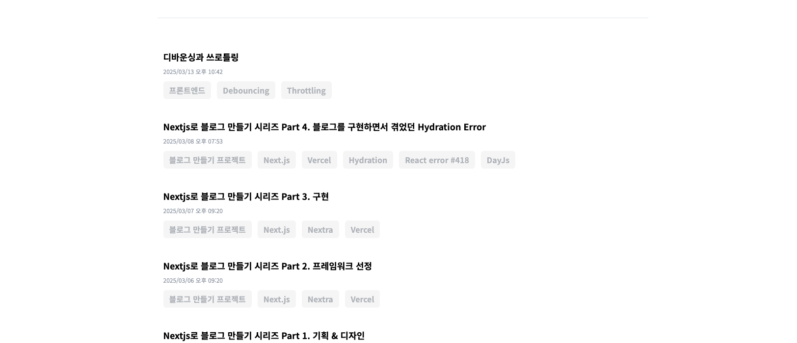

## 구현

여러분이 보고 계신 이 블로그를 어떻게 구현했는지에 대해 다루려고 합니다.  
앞서 소개해드린 것 처럼, 이 블로그는 Next.js를 기반으로 하는 Nextra를 사용해서 구현했습니다.  
또, 게시글은 MDX 문서로 작성합니다.

MDX 문서로 작성한 게시글을 어떻게 웹페이지로 랜더링하는지, 그렇게 만들어진 페이지 목록을 어떻게 조회하고 필터링하는지에 대해 소개해드리려고 합니다.

## MDX 문서를 웹페이지로 랜더링하는 과정

Nextra는 MDX 문서를 파싱하고 웹페이지로 랜더링합니다.  
이 때, 웹 페이지를 어떻게 랜더링할지는 `mdx-compoonents.tsx`라는 파일에서 `named export`하는 `useMDXComponents`를 읽고 결정합니다.

**mdx-components.tsx**

```ts
export const useMDXComponents = (components: ReactElement[]) => ({
  ...defaultComponents,
  ...components,
});
```

여기서 구조분해할당하는 `defaultComponents`객체를 커스터마이징해야 합니다.

## getNextraComponents()로 게시글 컴포넌트를 커스터마이징



getNextraComponents는 이름처럼 Nextra의 기본 컴포넌트 맵핑 정보를 반환하는 함수입니다.  
인자를 통해 원하는 컴포넌트를 우리가 만든 컴포넌트로 교체할 수 있습니다.

또, 해당 함수는 서버 사이드에서 호출되는 함수입니다. 따라서 비동기 함수를 사용할 수 있으며 서버 전용 API를 호출할 수 있습니다.

````tsx
const defaultComponents = getNextraComponents({
  // mdx 페이지 컴포넌트.
  wrapper: async ({ children, toc, metadata, bottomContent }) => {
    /**
     * 서버 전용 API를 호출해서 페이지 랜더링에 필요한 series, tags, post등의 정보를 조회.
     * 해당 코드가 길어서 생략했습니다!
     */

    return (
      <>
        <PostDetail toc={toc} series={series} tags={tags} post={post} bottomContent={bottomContent}>
          {children}
        </PostDetail>
      </>
    );
  },
  //  이미지 컴포넌트 오버라이드
  img: PostImage,
  //  코드블록(```) 컴포넌트 오버라이드
  pre: PostCodeblock,
});
````

wrapper는 MDX 페이지의 최상위 레이아웃을 감싸는 역할을 합니다.  
이걸 사용해서 게시글 페이지를 커스터마이징할 계획입니다.

게시글 상세페이지라고 해서 본문만 보여주진 않죠.  
헤더, 푸터, TOC(Table of contents), 이전, 다음 게시글 버튼도 보여줘야 합니다.

아래의 코드에서 보시는 것 처럼 커스터마이징할 수 있습니다.

```tsx
export function PostDetail({ children, series, post, bottomContent, toc }: PostDetailProps) {
  // ...생략

  return (
    <ArticleContainer>
      <section>
        <ArticleHeader right={<TOC toc={toc} />} />

        <Divider />

        {/* MDX를 파싱해서 생성한 DOM 엘리먼트의 스타일은 module.scss로 생성한 클래스로 처리합니다. */}
        <article className={classes.postDetail}>
          {/* 여기에 MDX를 파싱해서 생성한 DOM 엘리먼트가 들어갑니다  */}
          {children}
        </article>

        <footer>
          <PostNavigator mode="prev" post={post.prevPost} />
          <PostNavigator mode="next" post={post.nextPost} />
        </footer>
      </section>
    </ArticleContainer>
  );
}
```

MDX를 파싱하여 생성한 DOM 엘리먼트는 children props에 담겨있습니다.  
이 엘리먼트에 스타일을 적용하기 위해, `module.css`로 생성한 클래스를 사용했습니다.

```scss
.postDetail {
  h1,
  h2,
  h3 {
    font-weight: 700;
    padding: 20px 0;
  }

  p {
    padding-top: 16px;
    padding-bottom: 24px;
    line-height: 28px;
    word-break: keep-all;
  }

  ul,
  ol {
    padding: 5px 0;
  }
  // ...생략
}
```

위와 같이 postDetail 클래스는 하위 h1, h2, p, ul등의 엘리먼트의 스타일을 정의합니다.  
그리고 module.css로 작성했기에 클래스 이름은 고유한 해시로 변환되어 전역 네임스페이스와 충돌하지 않습니다.  
따라서 게시글 컴포넌트에만 스타일을 적용할 수 있어서 사용했습니다.

## MDX 페이지 목록을 조회하는 방법



랜딩 페이지나 시리즈 페이지에선 게시글 목록을 보여주어야 합니다.  
그런데 게시글은 mdx 문서인데다, 게시글의 제목, 생성일과 같은 메타 정보는 mdx를 파싱해야 알 수 있습니다.  
이 문제는 Nextra의 getPageMap과 normalizePages을 사용해서 해결할 수 있습니다.

이름에서 알 수 있는 것 처럼, getPageMap은 인자로 지정한 경로의 모든 페이지 맵 정보를 반환합니다.  
normalizePages는 getPageMap이 반환한 페이지 맵 정보를 가공합니다.  
Navbar, TOC, Post List등의 컴포넌트 구현에 적합한 형태로 데이터를 가공한다고 보시면 됩니다.  
기본 테마를 사용한다면, 반환객체를 그대로 사용하면 됩니다만, 커스텀 테마를 직접 구현하는 경우에도, 이걸 활용할 수 있습니다.

아래는 예시 코드입니다.

```ts
import { getPageMap } from 'nextra/page-map';
import { Item, normalizePages } from 'nextra/normalize-pages';

export async function findPosts(param: FindPostsProps = GetPostDefaultOption) {
  const { orderBy, limit, seriesId } = prepareParam<FindPostsProps>(param, GetPostDefaultOption);
  const fullRoute = resolveSeriesQuery(seriesId);

  // getPageMap으로 지정한 경로의 모든 페이지 정보를 가져온다.
  const pageMap = await getPageMap(fullRoute);

  // 가져온 페이지 정보를 가공한다.
  const { directories } = normalizePages({
    list: pageMap,
    route: '/posts',
  });

  // 필요한 만큼 데이터를 추가 가공한다(배열 평탄화, 필터링, 정렬, ...)
  let posts = directories
    .reduce((acc, curr) => collectPost(acc, curr), [] as Item[])
    .flat()
    .filter((post) => post.frontMatter)
    .filter((post) => !post.frontMatter.isSeriesLanding);

  if (orderBy) {
    posts.sort(sortPostByCreatedAt);
  }

  if (limit) {
    posts = posts.filter((_, i) => i < limit);
  }

  // 지정한 경로 밑의 모든 게시글 목록 반환
  return posts;
}
```

서버 컴포넌트에서 위의 findPosts를 호출하고 게시글 목록을 props로 내려줄 수 있습니다.  
이를 응용하여 랜딩 페이지에서 게시글 목록을 보여주는 기능을 구현할 수 있습니다.  
아래는 서버 컴포넌트 예시입니다.

```ts
export default async function LandingPage() {
  const seriesModels: SeriesModel[] = await getSeries();
  const seriesPosts: Record<string, PostModel[]> = {};

  for (const series of seriesModels) {
    if (series.id === Constants.series.latestId) {
      continue;
    }
    // findPosts를 통해 지정한 경로의 모든 게시글 목록을 조회
    const seriesPost = await findPosts({
      limit: 20,
      seriesId: series.id,
    });

    // 클라이언트 컴포넌트가 의존하는 타입인 PostModel로 변환
    seriesPosts[series.id] = seriesPost.map((item) => Mapper.toPostModel({ item, seriesModels }));
  }

  // Props로 게시글 목록 내려주기
  return <MainClientPage seriesPosts={seriesPosts} />;
}
```

클라이언트 컴포넌트는 props를 통해 받은 게시글 목록을 사용해서 랜딩페이지의 게시글 목록을 보여줄 수 있습니다.  
이러한 페이지는 SSG 방식으로 빌드됩니다.  
따라서 애플리케이션 빌드 시점에 서버 컴포넌트의 로직을 실행하여 가져온 데이터를 기반으로 정적 웹 페이지를 만들게 됩니다.  
새로운 포스트를 작성했다면, 새로 커밋하고 푸시해서 앱을 리빌드해야 목록에 새로운 포스트가 추가되는 방식입니다.

## 정리하면...

- Nextra의 API를 사용해서 MDX 문서를 파싱하여 생성한 페이지를 커스터마이징 할 수 있습니다.
- getNextraComponents를 사용해서 Nextra 기본 컴포넌트 맵핑을 커스터마이징할 수 있습니다.
- mdx로 생성한 페이지 목록은 getPageMap으로 가져옵니다. 그리고 normalizePage로 사용하기 쉽게 가공합니다.

긴 글 읽어주셔서 감사합니다!

export const metadata = {
  title: 'Nextjs로 블로그 만들기 시리즈 Part 3. 구현',
  description:
    '개인 블로그를 구현하면서 사용한 기술에 대해 소개합니다. route group, layout, Tailwind에 대해 다룹니다.',
  series: 'blog-making-series',
  tags: ['Next.js', 'Nextra', 'Vercel'],
  date: '2025-03-07 21:20',
};
